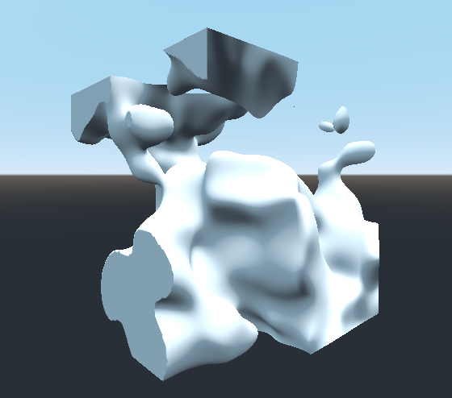

# Marching Cubes Algorithm in Godot

Implemented without using a lookup table approach. Screenshots built from a piece of OpenSimplexNoise.

## Iteration 1: Using Godot's ImmediateGeometry node

20x20x20 cubes

## Iteration 2: Smooth shading and using Godot's ArrayMesh

100x100x100 cubes, each cube is 0.1 units wide. OpenSimplexNoise period is 6. This number of cubes takes a long time (~2 minutes) to generate but after rendering you can move the viewport around very smoothly. Normals are now calculated directly from the noise field. Unfortunately there is a weird artifact along the edges where the field is clipped to a certain value.

## Iteration 3: ???

TODO: Make use of GPU shader?
